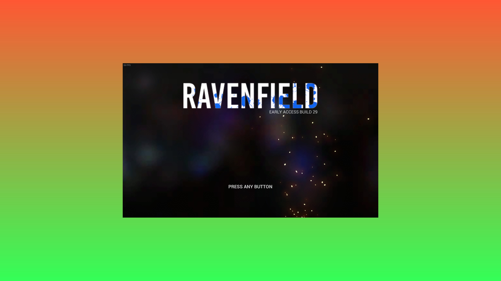

# AppContainer

## Description

AppContainer is a specialized C# application designed to enhance the gaming experience by providing a customizable container environment for games that have been made borderless using [Borderless Gaming](https://store.steampowered.com/app/388080/Borderless_Gaming/). It allows users to add custom backgrounds around borderless games, creating a more immersive and personalized gaming experience.

## Overview

AppContainer works in conjunction with Borderless Gaming. After a game has been made borderless, AppContainer creates a host window that embeds the borderless game window as a child, allowing for custom backgrounds and other enhancements. This is particularly useful for:

- Games that don't scale well to fullscreen
- Creating a more immersive experience with custom backgrounds
- Maintaining aspect ratios while filling the screen
- Adding branded or themed backgrounds to game streams




## Usage

To use AppContainer effectively:

1. Use [Borderless Gaming](https://store.steampowered.com/app/388080/Borderless_Gaming/) to make your game borderless.
2. Launch AppContainer with appropriate command-line arguments to capture and enhance the borderless game window.

Available arguments for AppContainer:

- `window-title`: The title of the borderless game window to embed (alternative to `window-handle`)
- `window-handle`: The handle of the borderless game window to embed (alternative to `window-title`)
- `width`: Desired width of the embedded game (-1 for current size, 0 for fullscreen)
- `height`: Desired height of the embedded game (-1 for current size, 0 for fullscreen)
- `background-image`: Path to an image file to use as background around the game
- `background-color`: Hex color code for a solid color background
- `background-gradient`: Two hex color codes separated by a semicolon for a gradient background

Example usage:

```
AppContainer.exe --window-title "My Borderless Game" --width 1920 --height 1080 --background-image path/to/custom_background.png
```

## How It Works

1. The user makes a game borderless using Borderless Gaming.
2. AppContainer creates a host window that covers the entire screen.
3. It locates the borderless game window using either the window title or handle.
4. The borderless game window is embedded as a child of the host window.
5. The background is set according to the provided arguments.
6. The game window is resized and centered within the host window if necessary.
7. AppContainer continues to monitor and adjust the game window as needed.

## Use Cases

AppContainer is particularly useful for:

- Enhancing games that don't scale well to fullscreen resolutions
- Adding themed backgrounds to match the game's aesthetics
- Creating a consistent look for game streaming or recording
- Improving the appearance of older games that don't support modern display ratios

## Requirements

- .NET 9
- Windows operating system
- [Borderless Gaming](https://store.steampowered.com/app/388080/Borderless_Gaming/)

## Building and Running

1. Clone the repository
2. Open the solution in Visual Studio or Visual Studio Code
3. Build the solution
4. Use Borderless Gaming to make your target game borderless
5. Run the AppContainer executable with appropriate command-line arguments

## Contributing

Contributions to AppContainer are welcome! Please feel free to submit pull requests, create issues or suggest improvements.

## License

MIT

## Disclaimer

AppContainer manipulates game windows that have been made borderless. Use it responsibly and be aware of the following:

1. No Warranty: AppContainer is provided "as is", without warranty of any kind, express or implied. The authors and contributors of AppContainer make no representations or warranties of any kind concerning the software, express or implied, including, without limitation, warranties of merchantability, fitness for a particular purpose, non-infringement, or the absence of latent or other defects, accuracy, or the presence or absence of errors, whether or not discoverable.

2. Anti-Cheat Compatibility: It is unknown how games with anti-cheat systems will interact with AppContainer. Using AppContainer with games that have anti-cheat mechanisms may potentially trigger false positives or result in unexpected behavior. Users should exercise caution when using AppContainer with such games and be aware of the potential risks to their game accounts.

3. Game Behavior: Some games may not behave as expected when run in this container. This could result in graphical glitches, performance issues, or other unexpected behavior.

4. Terms of Service: Always ensure you comply with the terms of service of the games you're using with AppContainer. Some game publishers may not approve of third-party software that manipulates game windows.

5. User Responsibility: By using AppContainer, you acknowledge and accept these risks. The developers of AppContainer are not responsible for any consequences that may arise from its use, including but not limited to game bans, account suspensions, or any other punitive actions taken by game publishers or anti-cheat systems.

Use AppContainer at your own risk and always prioritize compliance with game rules and terms of service.